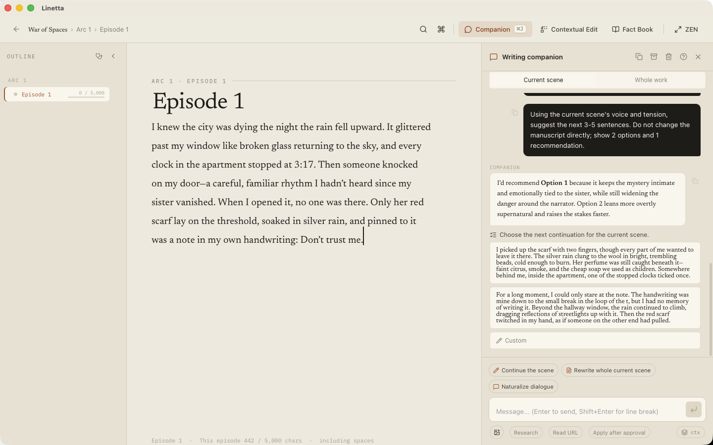

<div align="center">
  

# Linetta

### A calm, local-first writing studio for long-form fiction

Plan your story, keep your world consistent, write scene by scene, and work with an optional AI companion — without giving up control of your manuscript.

[](https://github.com/devlikebear/linetta/releases/latest)
[](https://github.com/devlikebear/linetta/actions/workflows/ci.yml)
[](LICENSE)

[Mac App Store](https://apps.apple.com/app/id6781664781) · [Download for Windows or Linux](https://github.com/devlikebear/linetta/releases/latest) · [Report an issue](https://github.com/devlikebear/linetta/issues)

English · 한국어 · 日本語
</div>



## One workspace for the whole story

Linetta is made for novelists and web-fiction writers who want their manuscript, outline, characters, places, relationships, and research close at hand — without turning writing into project management.

- **Write with focus.** Work scene by scene in a quiet editor with your outline always within reach.
- **Keep the story consistent.** Organize characters, places, relationships, storylines, beats, summaries, and memories beside the manuscript.
- **Stay in control of AI.** Ask the optional companion to read the current scene or the whole work. It can suggest drafts and structured changes, but you decide what gets applied.
- **Keep your work local.** Projects live in a local SQLite database with version snapshots and daily backups. No Linetta account or mandatory cloud is required.
- **Move your manuscript freely.** Import and export Markdown, and optionally sync exported work through Git.

## See Linetta in action

| Build with context | Research without leaving the scene |
| --- | --- |
| The companion can use your manuscript and story structure to offer continuations, revisions, and proposals. | Fact Book keeps source-backed notes next to the writing that needs them. |
|  |  |

Your projects stay organized in a library built for multiple works:


## Get Linetta

### Mac App Store

Linetta is free on the [Mac App Store](https://apps.apple.com/app/id6781664781).

### Homebrew on Apple Silicon

The direct macOS build is signed with an Apple Developer ID and notarized by Apple.

```sh
brew install --cask devlikebear/tap/linetta
```

Upgrade an existing Homebrew installation with:

```sh
brew update
brew reinstall --cask linetta
```

### Windows and Linux

Every [GitHub release](https://github.com/devlikebear/linetta/releases/latest) includes Windows NSIS and MSI installers plus Linux AppImage, `.deb`, and `.rpm` packages.

Intel Mac users can [build from source](#build-from-source).

## AI is optional

Linetta is a complete writing app without AI. If you choose to connect a supported provider, credentials are stored locally and manuscript text is sent only when you make an AI request.

The `Cmd/Ctrl+J` companion can:

- discuss the current scene or the whole work;
- suggest continuations and rewrites;
- inspect story context with built-in read tools;
- propose structured updates to scenes, outlines, characters, relationships, places, summaries, and memories;
- search or fetch web sources when you explicitly configure and use those tools.

Changes follow a **propose → review → apply** flow so the writer remains the final editor.

## Data and safety

Linetta stores writing data on your device:

```text
macOS    ~/Library/Application Support/com.devlikebear.linetta
Linux    ${XDG_DATA_HOME:-~/.local/share}/com.devlikebear.linetta
Windows  %APPDATA%\com.devlikebear.linetta
```

Important data includes:

- `library.db`: projects, scenes, story data, and version snapshots;
- `backups/YYYY-MM-DD/`: daily database backups, kept for 14 days;
- `companion/`: local companion transcripts and memories;
- `settings.json`: app preferences and provider configuration.

Manual and AI-replace snapshots are retained indefinitely. Autosave snapshots are thinned over time, from every save during the first day to daily snapshots after 30 days.

## Frequently asked questions

### Does Linetta require an account or subscription?

No. Writing, organization, import/export, snapshots, and backups work without a Linetta account or subscription.

### Do I have to use AI?

No. AI features are optional and remain inactive until you connect a provider.

### Can I bring an existing manuscript?

Yes. Linetta supports Markdown import and export so your writing is not locked into the app.

### Is my work uploaded to a Linetta cloud?

No. Linetta has no mandatory cloud. Optional AI and Git features communicate only with services you configure and invoke.

## For contributors

Linetta uses a Tauri 2 Rust shell, React 18, Vite, TypeScript, an embedded Go engine, and SQLite. The shell and engine communicate through JSON-RPC envelopes across a C ABI.

See the [development guide](docs/DEVELOPMENT.md) for architecture notes, versioning, mobile build targets, CI workflows, and troubleshooting.

### Build from source

Install the desktop dependencies once:

```sh
cd apps/desktop
pnpm install
```

Start the desktop app:

```sh
make dev
```

Build a desktop release for the current operating system:

```sh
make build-desktop
```

Build the standalone JSON-RPC engine for debugging:

```sh
make build-engine
```

### Verification

Run the full local gate:

```sh
make test
```

Useful focused checks:

```sh
make test-go
make test-desktop
make test-tauri
make test-mobile-engine
```

`make test` runs the Go test suite, frontend Vitest tests, the Vite production build, and Rust `cargo check`.

### Mobile engine development

The repository also builds the embedded engine for iOS and Android. These targets are intended for contributors working on the mobile runtime:

```sh
make build-mobile-engine-ios
make build-mobile-engine-android
```

The iOS target requires Xcode's iOS SDK. The Android target requires `ANDROID_NDK_HOME`.

## Contributing and feedback

Linetta is in active development. Bug reports, writing-workflow feedback, localization fixes, and focused pull requests are welcome through [GitHub Issues](https://github.com/devlikebear/linetta/issues).

If you are a novelist trying Linetta on a real project, feedback about where the app helps or interrupts your flow is especially valuable.

## License

Linetta is licensed under the GNU Affero General Public License version 3 only (`AGPL-3.0-only`). See [LICENSE](LICENSE) and [LICENSE-NOTICE.md](LICENSE-NOTICE.md) for details, including commercial licensing options.
