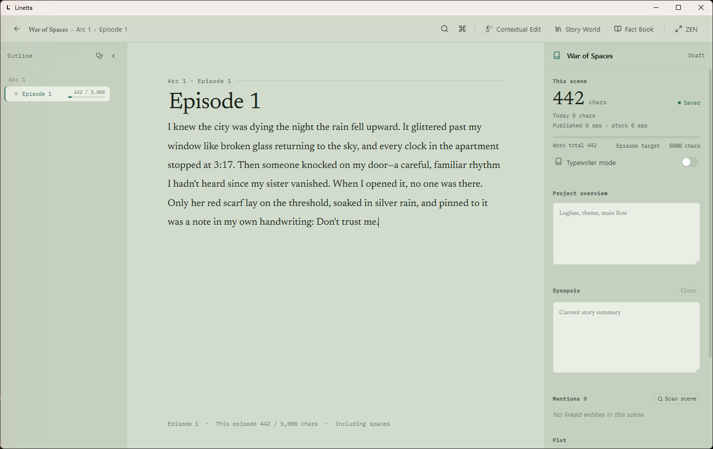
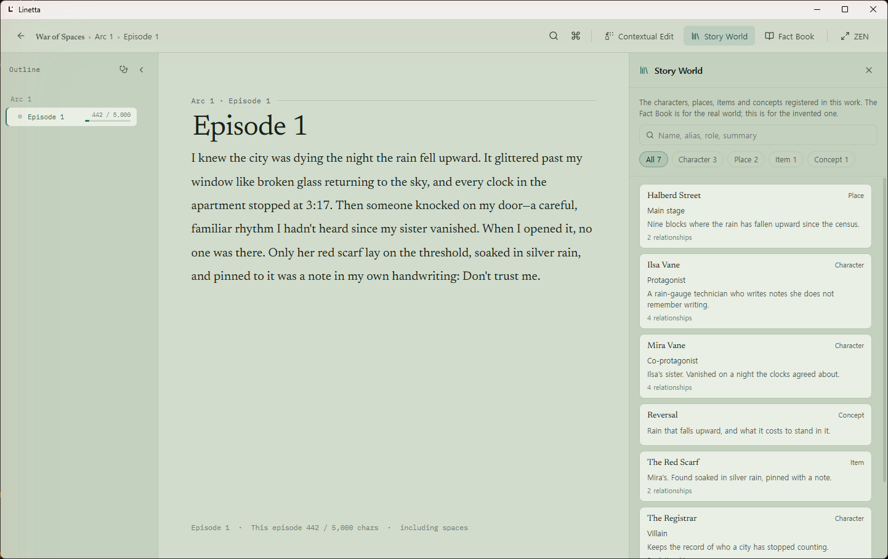
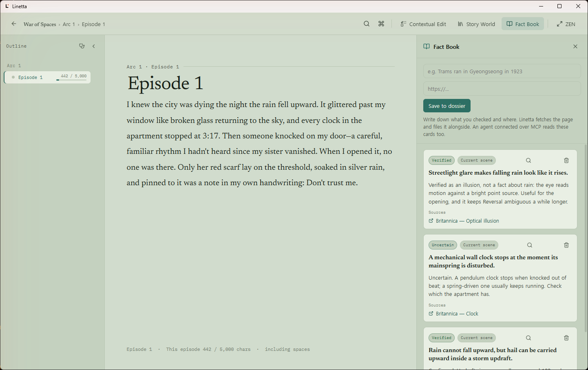
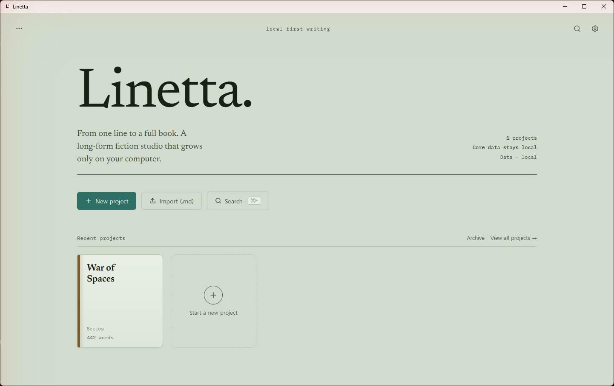

<div align="center">
  

# Linetta

### A calm, local-first writing studio for long-form fiction

Plan your story, keep your world consistent, and write scene by scene. When you want to write alongside AI, use Linetta's built-in agent or connect one you already run over MCP — neither happens on its own.

[](https://github.com/devlikebear/linetta/releases/latest)
[](https://github.com/devlikebear/linetta/actions/workflows/ci.yml)
[](LICENSE)

[Website](https://linetta.marvin-42.com) · [Mac App Store](https://apps.apple.com/app/id6781664781) · [Download for Windows or Linux](https://github.com/devlikebear/linetta/releases/latest) · [Report an issue](https://github.com/devlikebear/linetta/issues)

English · 한국어 · 日本語
</div>



## One workspace for the whole story

Linetta is made for novelists and web-fiction writers who want their manuscript, outline, characters, places, relationships, and research close at hand — without turning writing into project management.

- **Write with focus.** Work scene by scene in a quiet editor with your outline always within reach.
- **Keep the story consistent.** Organize characters, places, relationships, storylines, beats, summaries, and memories beside the manuscript.
- **Stay in control of AI.** Linetta calls a model only if you connect a provider — for the built-in agent, or your own agent over MCP. The activity log shows what changed and whether the built-in agent or an external client made the call, a recent structural change can be undone in one click while the app stays open, and the text an agent replaces is kept as a restorable version of the scene.
- **Keep your work local.** Projects live in a local SQLite database with version snapshots and daily backups. No Linetta account or mandatory cloud is required.
- **Move your manuscript freely.** Import and export Markdown, and optionally sync exported work through Git.

## See Linetta in action

| The work's own record | Research without leaving the scene |
| --- | --- |
| Story World lists the characters, places, items and concepts your work has registered — including the ones an agent created, whether the built-in agent or one connected over MCP. | Fact Book keeps source-backed notes next to the writing that needs them. |
|  |  |

Your projects stay organized in a library built for multiple works:



## Get Linetta

### Website

Product overview and downloads: [linetta.marvin-42.com](https://linetta.marvin-42.com).

### Mac App Store

Linetta is free on the [Mac App Store](https://apps.apple.com/app/id6781664781).

### Homebrew on Apple Silicon

The direct macOS build is signed with an Apple Developer ID and notarized by Apple.

```sh
brew install --cask devlikebear/tap/linetta
```

Upgrade an existing Homebrew installation with:

```sh
brew update
brew reinstall --cask linetta
```

### Windows and Linux

Every [GitHub release](https://github.com/devlikebear/linetta/releases/latest) includes Windows NSIS and MSI installers plus Linux AppImage, `.deb`, and `.rpm` packages.

Intel Mac users can [build from source](#build-from-source).

## Writing with the built-in agent (BYOK)

Linetta has a built-in writing agent, but it has nothing to call until you
bring your own connection to a model. Four providers are supported: ChatGPT
(Codex) by signing in with your ChatGPT account, and Anthropic, Google Gemini,
or an OpenAI-compatible endpoint — OpenRouter, or a model running on your own
machine — by API key.

Turn it on in **Settings → AI provider**. Consent is per provider, and it
gates even the connection test: that button is refused until you have given
that provider a credential and ticked its consent box. The one request that
runs on a credential alone is asking the provider which models it offers, so
the picker has something to list; that request carries no manuscript text.

An API key goes into your OS's secure credential store, never into
`settings.json`; signing in with Codex instead stores its tokens in Linetta's
own data directory, in a file only your account can read.

Linux has no secure credential store backend, so Anthropic, Google Gemini,
and the OpenAI-compatible endpoint cannot be configured there; signing in
with a ChatGPT account still works, since that path stores tokens in
Linetta's data directory instead.

Open the agent with `Cmd/Ctrl+J`; connect a provider first, or the panel
prompts you to set one up. It reaches Linetta's tools the same way an
external MCP client does, and every call it makes is recorded in the MCP
activity log, which shows whether the built-in agent or an external client
made it. A structural change — outline restructuring and the like — gets an
Undo button on its own line in the agent panel, good for one click while the
app stays open; only the last eight are held, in memory, and none survive a
restart. A scene-prose rewrite has no one-click undo yet, but it is not lost:
Linetta snapshots the scene before every agent write and keeps that version
indefinitely, so you can put the old text back from the scene's **Previous
versions** sheet.

### What the agent remembers

Linetta keeps two short documents an agent reads: a **writer profile** — how
you work, up to 1,400 characters — and **work notes** for each work, up to
2,200. Both are pasted whole into the built-in agent's system prompt at the
start of every turn, with a line saying how much of the budget is used, and
the agent records into them with its `linetta_edit_memory` tool. You can read
and rewrite both yourself in **Settings → Memory**, one work at a time.

**The writer profile is not scoped to the work you have open.** It is global,
and it is read for every work. Something an agent records about you while
working on one book is in the system prompt of every other book, and in the
story brief a connected MCP client receives on any work. Work notes stay with
their work.

Both live in `library.db`, so the daily backup and a restore carry them.

## Writing with your own agent (MCP)

Connecting an outside agent over MCP is a different thing from connecting a
provider in Settings: a writer who only wants MCP never has to give Linetta a
credential at all.

When you want to write alongside AI, Linetta opens a local MCP endpoint and an
agent you already run — Claude Code, Claude Desktop, Codex CLI, or Gemini CLI —
connects to it. The subscription you already pay for does the work; Linetta
stays a writing tool.

Turn it on in **Settings → Connect an external agent (MCP)**. It is off until
you tick an explicit consent box. When those clients are detected, Settings
offers one-click connect; the pane still gives you a copyable command to paste
into your client.

Once connected, an agent can:

- read the outline, a scene, characters, fact cards, and a story brief;
- draft and revise scenes, write summaries, and restructure the outline;
- record what it changed, so you can see it in the activity log.

The story brief also carries the writer profile and the work's notes described
above, in `read_only` and `full` alike. In `full` mode a client can write them with
`linetta_edit_memory`; in `read_only` that tool is not registered at all. A
client you have pinned to a single work can write only that work's notes — the
writer profile applies to every work, so it is outside the pin, and the tool
refuses it.

The writer keeps the last word. Every scene write is snapshotted before it
lands, and a recent outline restructuring can be reversed in one click — the
last eight, until the app is restarted; entity, storyline, beat, fact-card and
memory edits are logged but have to be reversed with another edit. `read_only` mode omits the writing tools
entirely, and a scene you are part way through editing is never replaced behind
your back — Linetta tells you the agent touched it and leaves your text alone
until you choose.

The endpoint binds `127.0.0.1` only, requires a token Linetta generates
locally, and stops the moment you turn it off.

## Data and safety

Linetta stores writing data on your device:

```text
macOS    ~/Library/Application Support/com.devlikebear.linetta
Linux    ${XDG_DATA_HOME:-~/.local/share}/com.devlikebear.linetta
Windows  %APPDATA%\com.devlikebear.linetta
```

Important data includes:

- `library.db`: projects, scenes, story data, version snapshots, the writer profile and work notes an agent reads, and the retired built-in companion's transcripts;
- `backups/YYYY-MM-DD/`: daily database backups, kept for 14 days;
- `<project id>/memory/experiences.jsonl`: facts an agent has been told to remember;
- `companion/`: the same file for facts remembered before 1.0, which nothing reads
  any more (see [Moving to Linetta 1.0](docs/migrating-to-1.0.md));
- `settings.json`: app preferences.

Manual and agent-write snapshots are retained indefinitely. Autosave snapshots are thinned over time, from every save during the first day to daily snapshots after 30 days.

## Frequently asked questions

### Does Linetta require an account or subscription?

No. Writing, organization, import/export, snapshots, and backups work without a Linetta account or subscription.

### Do I have to use AI?

No. Linetta is a complete writing app on its own. It does not contact a model
until you set one up: connect a provider and give it your consent, for the
built-in agent, or connect your own agent over MCP, which needs no provider
credential at all.

### Can I bring an existing manuscript?

Yes. Linetta supports Markdown import and export so your writing is not locked into the app.

### Is my work uploaded to a Linetta cloud?

No. Linetta has no cloud. The MCP endpoint is local to your machine, and Git sync talks only to the remote you configure.

## For contributors

Linetta uses a Tauri 2 Rust shell, React 18, Vite, TypeScript, an embedded Go engine, and SQLite. The shell and engine communicate through JSON-RPC envelopes across a C ABI.

See the [development guide](docs/DEVELOPMENT.md) for architecture notes, versioning, mobile build targets, CI workflows, and troubleshooting.

### Build from source

Install the desktop dependencies once:

```sh
cd apps/desktop
pnpm install
```

Start the desktop app:

```sh
make dev
```

Build a desktop release for the current operating system:

```sh
make build-desktop
```

Build the standalone JSON-RPC engine for debugging:

```sh
make build-engine
```

### Verification

Run the full local gate:

```sh
make test
```

Useful focused checks:

```sh
make test-go
make test-desktop
make test-tauri
make test-mobile-engine
```

`make test` runs the Go test suite, frontend Vitest tests, the Vite production build, and the Tauri shell's `cargo check` and `cargo test`.

### Mobile engine development

The repository also builds the embedded engine for iOS and Android. These targets are intended for contributors working on the mobile runtime:

```sh
make build-mobile-engine-ios
make build-mobile-engine-android
```

The iOS target requires Xcode's iOS SDK. The Android target requires `ANDROID_NDK_HOME`.

## Contributing and feedback

Linetta is in active development. Bug reports, writing-workflow feedback, localization fixes, and focused pull requests are welcome through [GitHub Issues](https://github.com/devlikebear/linetta/issues).

If you are a novelist trying Linetta on a real project, feedback about where the app helps or interrupts your flow is especially valuable.

## License

Linetta is licensed under the GNU Affero General Public License version 3 only (`AGPL-3.0-only`). See [LICENSE](LICENSE) and [LICENSE-NOTICE.md](LICENSE-NOTICE.md) for details, including commercial licensing options.
